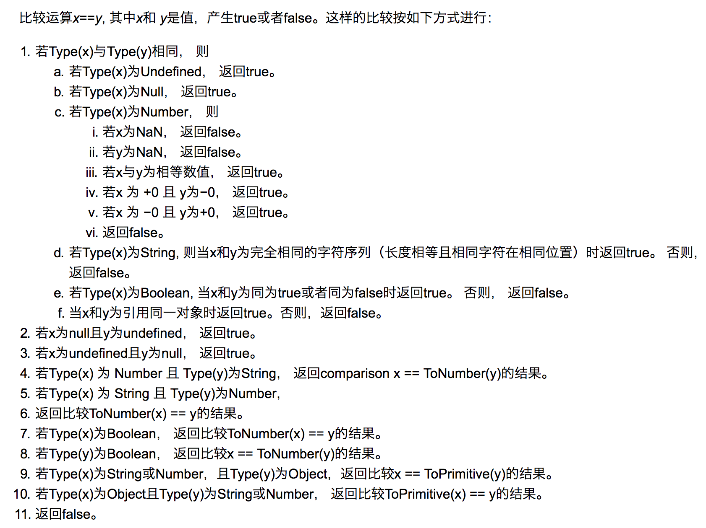
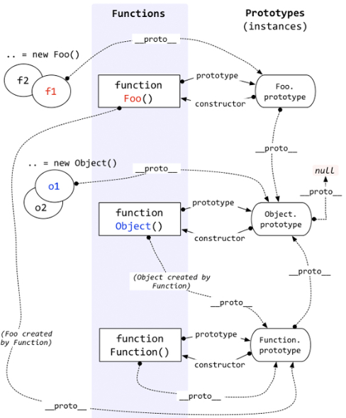

# JavaScript

[TOC]

## 内置类型

JS中分为其中内置类型，七种内置类型分为两大类：**基本类型**和**对象**（`Object`）

基本类型有六种：

```javascript
null undefined Boolean number string symbol
```

> 就是的数字类型时浮点类型的，没有整形。NaN也属于`number`类型，并且`NaN`不等于自身。

```javascript
let a = 111  //这只是字面量，不是number类型
a.toString() // 使用的时候才会转换为对象类型
```

对象（`Object`） 是引用类型，在使用的过程中会遇到深拷贝浅拷贝的问题。

```javascript
let a = {name:'EF'}
let b = a
b.name = 'EF'
console.log(a.name)//EF
```

## typeof

`typeof`对于基本类型，除了`null`都可以正常显示。

```javascript
typeof 1 // 'number'
typeof '1' // 'string'
typeof undefined // 'undefined'
typeof true // 'boolean'
typeof Symbol() // 'symbol'
typeof b // b 没有声明，但是还会显示 undefined
```

`typeof`对于对象，除了函数都会显示`object`

```javascript
typeof [] // 'object'
typeof {} // 'object'
typeof console.log // 'function'
```

对于`null`来说，它虽然是基本类型，但是会显示`object`，这是一个存在很久了的bug

>*PS：为什么会出现这种情况呢？因为在 JS 的最初版本中，使用的是 32
>位系统，为了性能考虑使用低位存储了变量的类型信息，**000* *开头代表是对象，然而* *null* *表示为全零，所以将它错误的判断为* *object**。虽然现在的内部类型判断代码已经改变了，但是对于这个 Bug
>却是一直流传下来。*

如果我们想获得一个变量的正确类型，可以通过Object.prototype.toString.call(xx)。这样我们可以获得类似[object Type] 的字符串。

```javascript
const getType = v =>
  v === undefined ? 'undefined' : v === null ? 'null' : v.constructor.name.toLowerCase();

```

[getType，来自30-seconds](https://github.com/30-seconds/30-seconds-of-code#gettype)

## 类型转换

### 转boolean

在条件判断时，除了`undefined`，`unll`，`false`，`NaN`，`''`，`0`，`-0`，其他所有值都转为`true`，包括所有对象。

### 对象转基本类型

对象在转换基本类型时，首先会调用`valueOf`然后调用`toString`。并且这两个方法是可以重写的。

```javascript
let a = {
	valueOf() {
	    return 0
	}
}
```

当然你也可以重写`Symbol.toPrimitive`,该方法在转基本类型时调用优先级最高。

```javascript
let a = {
	valueOf() {
		return 0;
	},
	toString() {
		return '1';
	},
	[Symbol.toPrimitive]() {
		return 2;
	}
}
1 + a // => 3
'1' + a // => '12'
```

### 四则运算符

只有当加法运算时，其中一方是字符串类型，就会把另一个也转化为字符串类型。其他运算符只要其中一方为数字，那么另一方就转为数字。并且加法运算符会触发三种类型转换：将值转换为原始值，转换为数字，转换为字符串。

```javascript
1 + '1' // '11'
2 * '2' // 4
[1, 2] + [2, 1] // '1,22,1'
// [1, 2].toString() -> '1,2'
// [2, 1].toString() -> '2,1'
// '1,2' + '2,1' = '1,22,1'
```

对于加好需要注意这个表达式`'a' + + 'b'`

```javascript
'a' + + 'b' // -> "aNaN"
// 因为 + 'b' -> NaN
// 你也许在一些代码中看到过 + '1' -> 1
```

### ==操作符



### 比较运算符

1. 如果是对象，就通过`toPrimitive`转换对象
2. 如果是字符串，就通过`unicode`字符串索引来比较

## 原型




每个函数都有`prototype`属性，除了`Function.peototype.bind()`，该属性指向原型

每个对象都有__`proto`__属性，指向了创建该对象的构造函数的原型。其实这个属性指向了`[[prototype]]`，但是`[[prototype]]`是内部属性，我们并不能访问到，所以使用_`proto`_来访问。

对象可以通过__`proto`__来寻找不属于该对象的属性，__`proto`__将对象链接起来组成了原型链。

[深入解析原型中的各个难点](https://github.com/KieSun/Dream/issues/2)

## new

1. 新生成一个对象

2. 链接到原型

3. 绑定this

4. 返回新对象

   

在调用new的过程中会发生以上四件事情。

```javascript
function create(){
	//创建一个空对象
	let obj = new Object()
	//获得构造函数
	let Con = [].shift.call(arguments)
	//链接到原型
	obj.__proto__ = Con.prototype
	//绑定this，执行构造函数
	let result = Con.apply(obj,arguments)
	//确保new出来的是个对象
	return typeof result ==='object'?result:obj
}

```

对于实例对象来说，都是通过`new`产生的，无论是`function Foo()`还是`let a = {b:1}`。

对于创建一个对象来说，更推荐使用字面量的方式创建对象（无论性能还是可读性）。因为你使用`new Object()`的方式创建对象需要通过作用域链一层一层找到`Object`，但是你使用字面量的方式就没这个问题。

## instanceof

instanceof可以正确的判断对象的类型，因为内部机制是通过判断对象的原型链中是不是能找到类型的prototype。

## this

this是很容易混淆的概念

```javascript
var obj = {   
    foo: function(){   
        console.log(this)   
    }   
}   
var bar = obj.foo  
obj.foo()  // 打印出的 this 是 obj
bar() // 打印出的 this 是 window 
```


### 函数调用


JS(ES5)里面有三种函数调用方式

```javascript
func(p1, p2)    
obj.child.method(p1, p2)   
func.call(context, p1, p2) *// 先不讲 apply*   
```

第三种调用方式,才是正常调用


其他两种都是语法糖,可以等价地变为`call`形式:

`func(p1,p2)` 等价于`func.call(undefined,p1,p2)`

`obj.child.method(p1,p2)` 等价于`obj.child.method.call(obj.child,p1,p2)`

至此函数调用只有一种形式:

**`func.call(context,p1,p2)`**

这样,this就好解释了this就是上面的context

this是你call一个函数时传的context,由于你从来不用call形式的函数调用,所以你一直不知道.

先看`func(p1,p2)`中的this如何确定:

```javascript
function func() {   
    console.log(this)   
}   
func()   
*// 等价于*   
func.call(undefined)    
*//可以简写为*   
func.call()   
*//按照说打印出来的this就是undefined,但是浏览器有一条规则*   
*/***   **   
如果你传的context是null或undefined,那么window对象就是默认的context(严格模式下默认context是undefined)*   
** 因此上面的打印结果是window.*   **/*   
```

因此上面打印的结果是window.如果希望这里是this不是window:

```javascript
 func.call(obj) //这里的this就是obj对象  


var obj = {
	foo:function(){
		console.log(this);
	}
}
var bar = obj.foo
obj.foo() //转换为obj.foo.call(obj) this就是这里的obj
bar()
//转换为 bar.call()
//由于没有传入context
//所以this就是undefined
//最后浏览器给你一个默认的this--window对象
```


### []**语法

```javascript
function fn() {   
    console.log(this);   
}   
var arr = [fn,fn2]   
arr[0] *//这里的this是什么?*   
```


我们可以把arr[0]() 想象为arr.0()

obj.child.method(obj.child,p1,p2)

arr.0.call(arr)

所以这里的this就是arr

小结

1. this就是你call一个函数时,传入的第一个参数
2. 如果你的函数调用不是call形式,请将其转换为call形式

## 闭包

闭包的定义很简单：函数A返回了函数B，并且B中使用了函数A的变量，函数B就被称为闭包。

## 深浅拷贝


## 模块化


## 防抖


## 节流


## 继承


## call、bind、apply 的区别


## Promise

Promise是ES6新增的语法，解决了回调地狱的问题。


## Generator


## Map、FlatMap、Reduce


## async 和await


## Proxy


## 0.1+0.2！=0.3


## 正则表达式


## ES6


## 算法


## 工具函数片段

